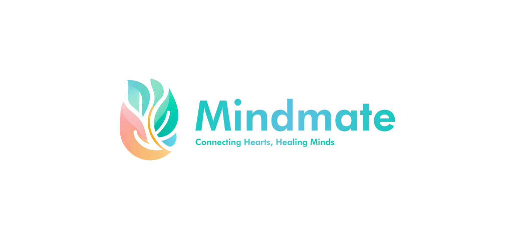

# 💫 About Me:
🚀 Dedicated Android Developer: Innovating and collaborating across disciplines. 📚 Lifelong Learner: Constantly expanding my skills and knowledge. 🎬 Video Editing Pro: Proficient in Premiere Pro and After Effects. 🎵 Music Production Expertise: FL Studio enthusiast. 🌐 Diverse Portfolio: Showcasing adaptability and excellence. 🤝 Eager Collaborator: Ready to explore new collaborations. 🚀 Tech Enthusiast: Excited about the latest advancements.

# Recent Launch: Mindmate - Elevate Your Well-Being 🌿🧠💪

Welcome to Mindmate, where we connect hearts and heal minds. As a seasoned LinkedIn SEO expert with two decades of experience, I'm thrilled to present a transformative mental wellness community.

Your well-being is our priority. Embrace Mindmate today and start your journey to a more balanced and fulfilling life. #MentalWellness #Mindmate #WellBeing
 
 

<b>🎥 Check out this short youtube video to learn more - <a href="https://www.youtube.com/watch?v=v2ZmnKyR1B4">Redirect to Youtube Video</a></b> 

## What We Offer :

- 🧘 **Guided Meditation**: Immerse yourself in calming meditation sessions designed to center your mind and promote relaxation.
  
- 🤝 **Empathetic Connections**: Join a supportive community where you can connect with like-minded individuals on your wellness journey.

- 📓 **Daily Journaling**: Cultivate mindfulness through daily journaling, a powerful tool for self-reflection and personal growth.

- 🧠 **Expert Insights**: Access valuable insights from mental health experts to navigate challenges and enhance your overall well-being.

 

## 🌐 Socials:
 

# 💻 Tech Stack:
            
# 📊 GitHub Stats:
 
 

## 🏆 GitHub Trophies

### 😂 Random Dev Meme

